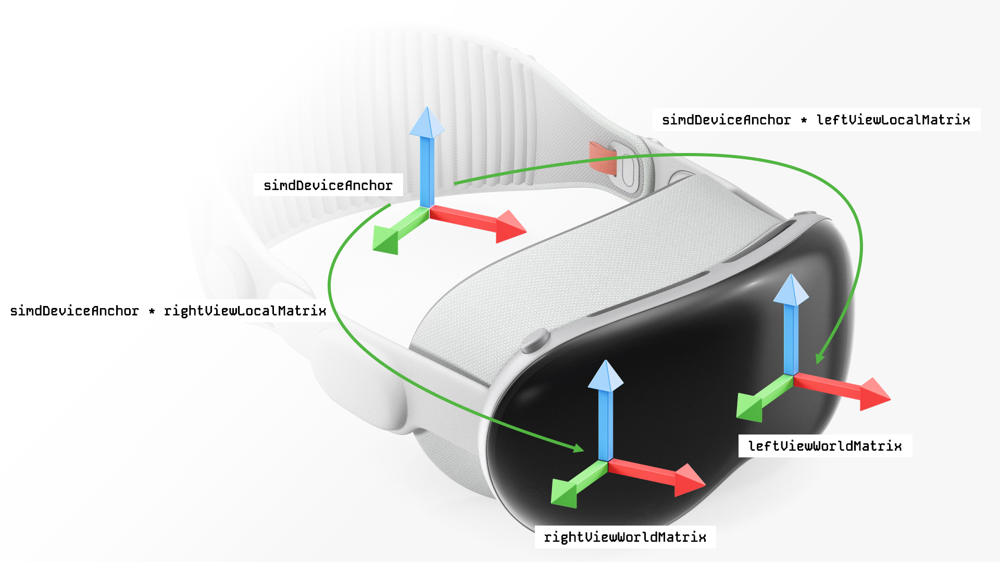

# 使用 Metal 渲染 API 在 Apple Vision 上绘制图形

> Gemini Flash 翻译为主. 可以回到原文使用其他模型翻译 Markdown.

## 目录

1. [Introduction](#introduction)
   1. [Why Write This Article?](#why-write-this-article)
   1. [Metal](#metal)
   2. [Compositor Services](#compositor-services)
2. [Creating and configuring a `LayerRenderer`](#creating-and-configuring-a-layerrenderer)
   1. [Variable Rate Rasterization (Foveation)](#variable-rate-rasterization-foveation)
   2. [Organising the Metal Textures Used for Presenting the Rendered Content](#organising-the-metal-textures-used-for-presenting-the-rendered-content)
3. [Vertex Amplification](#vertex-amplification)
   1. [Preparing to Render with Support for Vertex Amplification](#preparing-to-render-with-support-for-vertex-amplification)
   2. [Enabling Vertex Amplification for a Render Pass](#enabling-vertex-amplification-for-a-render-pass)
   3. [Specifying the Viewport Mappings for Both Render Targets](#specifying-the-viewport-mappings-for-both-render-targets)
   4. [Computing the View and Projection Matrices for Each Eye](#computing-the-view-and-projection-matrices-for-each-eye)
   5. [Adding Vertex Amplification to our Shaders](#adding-vertex-amplification-to-our-shaders)
      1. [Vertex Shader](#vertex-shader)
      2. [Fragment Shader](#fragment-shader)
4. [Updating and Encoding a Frame of Content](#updating-and-encoding-a-frame-of-content)
   1. [Rendering on a Separate Thread](#rendering-on-a-separate-thread)
   2. [Fetching a Next Frame for Drawing](#fetching-a-next-frame-for-drawing)
   3. [Getting Predicted Render Deadlines](#getting-predicted-render-deadlines)
   4. [Updating Our App State Before Rendering](#updating-our-app-state-before-rendering)
   5. [Waiting Until Optimal Rendering Time](#waiting-until-optimal-rendering-time)
   6. [Frame Submission Phase](#frame-submission-phase)
5. [Supporting Both Stereoscopic and non-VR Display Rendering](#supporting-both-stereoscopic-and-non-vr-display-rendering)
   1. [Two Rendering Paths. `LayerRenderer.Frame.Drawable` vs `MTKView`](#two-rendering-paths-layerrendererframedrawable-vs-mtkview)
   3. [Adapting our Vertex Shader](#adapting-our-vertex-shader)
6. [Gotchas](#gotchas)
   1. [Can't Render to a Smaller Resolution Pixel Buffer when Foveation is Enabled](#cant-render-to-a-smaller-resolution-pixel-buffer-when-foveation-is-enabled)
   2. [Postprocessing](#postprocessing)
   3. [True Camera Position](#true-camera-position)
   4. [Apple Vision Simulator](#apple-vision-simulator)
   5. [Reality Composer Pro](#reality-composer-pro)
      1. [Problems with `LayerRenderer.Layout.layered` Setup](#problems-with-layerrendererlayoutlayered-setup)

## Introduction

截至本文撰写之时，Apple Vision Pro 已经上市七个月，发布了大量游戏，并且越来越多的开发者进入了这个领域。在渲染方面，大多数开发者选择成熟的游戏引擎，如 Unity 或 Apple 的高级 API，如 RealityKit。 然而，从一开始就存在另一种选择：使用 Metal API 构建自己的渲染引擎。 尽管具有挑战性，但这种方法可以完全控制渲染管线，精确到每一帧提交给 GPU 的每一个字节和每一个命令。

> **_注意_**: visionOS 2.0 允许使用 Metal API 渲染图形，并在**混合**模式下与用户的周围环境（由设备的摄像头捕获）进行合成。本文重点介绍在完全沉浸式模式下开发 Metal 应用，尽管文章末尾也会讨论透视渲染。在 Apple Vision Pro 发布时，visionOS 1.0 仅允许在**沉浸式**模式下使用 Metal API 进行渲染。

### Why Write This Article?

主要作为对我所学知识的回顾。我在构建我的第一个 Apple Vision 游戏 [RAYQUEST](https://rayquestgame.com/) 时使用了所有这些知识。我不会介绍任何突破性的技术，也不会介绍任何你在 Apple 文档和官方示例中找不到的东西，除了我在开发游戏过程中发现的一些陷阱。事实上，我建议将本文视为 Apple 示例的补充阅读材料。你可以先阅读它们，或者先阅读本文。在解释接下来的概念时，我会尽可能多地链接到 Apple 的相关文档和示例。

### Metal

直接引用苹果[文档](https://developer.apple.com/metal/)：

Metal 是一种现代化的、紧密集成的图形和计算 API，同时配备了强大的着色语言，它专门为 Apple 平台设计和优化。 其低开销模型使您可以直接控制 GPU 执行的每个任务，从而最大限度地提高图形和计算软件的效率。 Metal 还包含一套无与伦比的 GPU 性能分析和调试工具，可帮助您提高性能和图形质量。

在这篇文章中，我不会过多关注 Metal 的内在原理，但我想提一下，它的 API 已经相当成熟，文档完善，并且有大量的教程和示例。我个人觉得使用 Metal **非常愉快**。如果你想学习它，我建议你阅读[这本书](https://www.kodeco.com/books/metal-by-tutorials/v4.0)。它比诸如 OpenGL ES 这样的 API 更明确，在设置渲染管线和渲染帧时需要更多的规划，但仍然非常平易近人，并且比 Vulkan 或 DirectX12 更适合初学者。此外，Xcode 内置了高质量的 Metal 性能分析器和调试器，可以让你检查你的 GPU 工作负载以及你的着色器输入、代码和输出。

### Compositor Services

Compositor Services 是一个 visionOS 平台特有的 API，它将你的 SwiftUI 代码与 Metal 渲染引擎连接起来。它使你能够直接向 Apple Vision 显示屏编码并提交绘图命令，这些显示屏包括用于左眼和右眼的独立屏幕。

在应用程序初始化时，Compositor Services 会自动创建并配置一个 [`LayerRenderer`](https://developer.apple.com/documentation/compositorservices/layerrenderer) 对象，以便在应用程序生命周期内管理 Apple Vision 上的渲染。 该配置包括纹理布局、像素格式、注视点渲染设置(foveation settings)以及其他渲染选项。 如果没有提供自定义配置，Compositor Services 将默认使用其标准设置。 此外，`LayerRenderer` 提供时间信息，以优化渲染循环并确保高效的帧交付。


## Creating and configuring a `LayerRenderer`

在我们的场景创建代码中，我们需要传递一个遵循 [`CompositorLayerConfiguration`](https://developer.apple.com/documentation/compositorservices/compositorlayerconfiguration) 协议的类型，作为参数传递给我们的场景内容。 系统将使用该配置来创建一个 `LayerRenderer`，它将持有诸如最终颜色和深度缓冲区的像素格式、用于向 Apple Vision 显示器呈现渲染内容的纹理的组织方式、是否启用了注视点渲染等等信息。 稍后会详细介绍这些花哨的术语。 以下是一些样板代码：


```swift
struct ContentStageConfiguration: CompositorLayerConfiguration {
  func makeConfiguration(capabilities: LayerRenderer.Capabilities, configuration: inout LayerRenderer.Configuration) {
      // 明确指定 Apple Vision 将为我们创建的颜色和深度输出纹理的格式
      configuration.depthFormat = .depth32Float
      configuration.colorFormat = .bgra8Unorm_srgb

      // TODO: 我们将在文章稍后部分进一步调整其余配置。
  }
}

@main
struct MyApp: App {
  var body: some Scene {
    WindowGroup {
      ContentView()
    }
    ImmersiveSpace(id: "ImmersiveSpace") {
      CompositorLayer(configuration: ContentStageConfiguration()) { layerRenderer in
         // `layerRenderer` 将用于渲染、帧时序以及引擎中的其他展示信息。
      }
    }
  }
}
```

### Variable Rate Rasterization (Foveation)

可变速率光栅化 (注视点渲染)


接下来我们需要设置的是是否在 `LayerRenderer` 中启用对**注视点渲染（foveation）**的支持。注视点渲染允许我们以更高的分辨率渲染眼睛直接注视的内容，并以较低的分辨率渲染其他所有内容。这在 VR 中非常有用，因为它能提高性能。

Apple Vision 为我们自动处理眼动追踪和注视点 (实际上，由于安全考虑，开发者**完全**无法访问用户的注视点)。我们需要设置我们的 `LayerRenderer` 以支持它，然后我们将在渲染过程中“自动”获得它。当我们渲染到 `LayerRenderer` 纹理时，Apple Vision 会自动调整分辨率，使其在我们直接注视的纹理区域更高。 这是先前配置 `LayerRenderer` 的代码，已更新以支持注视点：

```swift
func makeConfiguration(capabilities: LayerRenderer.Capabilities, configuration: inout LayerRenderer.Configuration) {
   // ...

   // Enable foveation, 启用注视点
   let foveationEnabled = capabilities.supportsFoveation
   configuration.isFoveationEnabled = foveationEnabled
}
```

### Organising the Metal Textures Used for Presenting the Rendered Content

组织用于呈现渲染内容的 Metal 纹理

我们已经确定需要将内容渲染为两个视图，分别对应 Apple Vision 的左眼和右眼显示。 在用于绘制的纹理布局组织方面，我们有三个选项：

1. [`LayerRenderer.Layout.dedicated`](https://developer.apple.com/documentation/compositorservices/layerrenderer/layout/dedicated) - 一个布局，它为每个渲染的视图分配一个单独的纹理。两只眼睛 - 两个纹理。
2. [`LayerRenderer.Layout.shared`](https://developer.apple.com/documentation/compositorservices/layerrenderer/layout/shared) - 一种使用单个纹理来存储所有渲染视图内容的布局。 一个足够大的纹理，可同时用于双眼。
3. [`LayerRenderer.Layout.layered`](https://developer.apple.com/documentation/compositorservices/layerrenderer/layout/layered) - 一个布局，将每个视图的内容指定为具有两个切片的单个 3D 纹理的一个切片。

你应该使用哪一个？苹果官方示例使用 `.layered`。理想情况下，使用 `.shared` 或 `.layered`，因为管理一个纹理可以减少需要跟踪的事项、减少提交的命令以及减少 GPU 上下文切换。一些对 Apple Vision 渲染技术非常重要的技术，例如顶点放大，不能与 `.dedicated` 一起使用，因为它期望使用单独的渲染通道来绘制每个眼睛纹理的内容，因此最好避免使用它。

让我们再次更新配置代码：

```swift
func makeConfiguration(capabilities: LayerRenderer.Capabilities, configuration: inout LayerRenderer.Configuration) {
   // ...

   // 设置 LayerRenderer 的纹理布局配置
   let options: LayerRenderer.Capabilities.SupportedLayoutsOptions = foveationEnabled ? [.foveationEnabled] : []
   let supportedLayouts = capabilities.supportedLayouts(options: options)

   configuration.layout = supportedLayouts.contains(.layered) ? .layered : .shared
}
```

这完成了 `LayerRenderer` 的基本配置，以便渲染我们的内容。我们设置了纹理的像素格式、是否启用注视点以及用于渲染的纹理布局。让我们继续渲染我们的内容。

### Vertex Amplification

顶点放大

假设我们想在 Apple Vision 上渲染一个三角形。一个三角形由 3 个顶点组成。如果我们在一个“普通”的非 VR 显示器上渲染它，我们会将 3 个顶点提交给 GPU，然后让它为我们绘制。在 Apple Vision 上，我们有两个显示器。我们该如何操作呢？一个简单的方法是提交两个绘图命令：

1. 发出绘制命令 **A**，将 3 个顶点渲染到左眼显示器。
2. 发出绘制命令 **B**，再次渲染相同的 3 个顶点，这次是为右眼显示器。

> **_注意_** 如果你在设置 `LayerRenderer` 时选择了 `.dedicated` 纹理布局，则需要将所有内容渲染两次并发出双倍数量的命令。

这并非最优方案，因为它使提交到 GPU 以进行渲染的命令数量翻倍。对于一个由 3 个顶点组成的三角形来说这还可以接受，但对于几何体数量中等的更复杂场景来说，很快就会变得难以处理。幸运的是，Metal 允许我们通过一种名为 **顶点放大 (Vertex Amplification)** 的技术，一次性地为两个显示器提交这 3 个顶点。

以下摘自苹果公司关于顶点放大的这篇优秀[文章](https://developer.apple.com/documentation/metal/render_passes/improving_rendering_performance_with_vertex_amplification)：

> 通过顶点放大，你可以编码绘制命令，以便多次处理相同的顶点，每个渲染目标一次。

这对我们来说非常有用，因为上面引文中的一个“render target（渲染目标）”可以直接翻译成 Apple Vision 上的一个显示器。左眼和右眼各一个显示器 - 两个渲染目标，我们可以将相同的 3 个顶点提交一次，让 Metal API 通过硬件加速，**同时**免费地为我们“放大”它们，并将它们渲染到两个显示器上。顶点放大技术不仅仅用于在 Apple Vision 上渲染到两个显示器，它在诸如 Cascaded Shadowmaps (层叠阴影贴图) 等通用图形技术中也有其优势。在层叠阴影贴图中，我们提交一个顶点，并将其渲染到多个“级联”（表示为纹理切片）中，以获得更具适应性和更好看的实时阴影。

#### Preparing to Render with Support for Vertex Amplification

准备使用顶点放大支持进行渲染

但是回到顶点放大作为一种高效渲染到 Apple Vision 显示器的方式。假设我们想在 Apple Vision 上渲染前面提到的 3 顶点三角形。为了在任何 Apple 设备上渲染任何东西，无论是使用非 VR 显示器还是两个显示器的设置，我们需要创建一个 [`MTLRenderPipelineDescriptor`](https://developer.apple.com/documentation/metal/mtlrenderpipelinedescriptor)，它将保存单个渲染通道中渲染对象所需的所有状态。比如要使用的顶点和片段着色器、渲染时要使用的颜色和深度像素格式、如果我们使用 MSAA 时的样本计数等等。在 Apple Vision 的情况下，在创建 `MTLRenderPipelineDescriptor` 时，我们需要显式设置 `maxVertexAmplificationCount` 属性：

```swift
let pipelineStateDescriptor = MTLRenderPipelineDescriptor()
pipelineStateDescriptor.vertexFunction = vertexFunction
pipelineStateDescriptor.fragmentFunction = fragmentFunction
pipelineStateDescriptor.maxVertexAmplificationCount = 2
// ...
```

#### Enabling Vertex Amplification for a Render Pass

为渲染通道启用顶点放大

我们现在有了一个 `MTLRenderPipelineDescriptor`，它代表了一个启用了顶点放大的图形管线配置。我们可以使用它来创建一个渲染管线，由 [`MTLRenderPipelineState`](https://developer.apple.com/documentation/metal/mtlrenderpipelinestate) 表示。一旦创建了这个渲染管线，渲染这个管线的调用就需要被编码成每帧的命令列表，并提交给 GPU。 这样的命令有哪些例子？ 想象一下，我们正在构建一个包含两个对象的游戏，并且在每一帧中执行以下操作：

1. 在渲染之前设置清除颜色。
2. 设置视口大小。
3. 设置我们正在渲染的渲染目标。
4. 使用在步骤 1 中设置的清除颜色清除渲染目标的内容。
5. 设置对象 A 的 `MTLRenderPipelineState` 为激活状态。
6. 渲染对象 A。
7. 设置对象 B 的 `MTLRenderPipelineState` 为激活状态。
8. 渲染对象 B。
9. 将上述所有命令提交给 GPU。
10. 将生成的像素值写入到某个像素附件。

所有这些渲染命令代表一个在游戏运行时每一帧都会发生的**渲染通道**。这个渲染通道通过 [`MTLRenderPassDescriptor`](https://developer.apple.com/documentation/metal/mtlrenderpassdescriptor) 配置。我们需要配置渲染通道以使用注视点并同时输出到两个渲染目标。

1. 通过向我们的 `MTLRenderPassDescriptor` 提供 [`rasterizationRateMap`](https://developer.apple.com/documentation/metal/mtlrenderpassdescriptor) 属性来启用注视点。这个属性，由 [`MTLRasterizationRateMap`](https://developer.apple.com/documentation/metal/mtlrasterizationratemap) 表示，在幕后由 Compositor Services 为我们创建。我们无法直接参与它的创建。相反，我们需要查询它。在每一帧，`LayerRenderer` 将会提供给我们一个 [`LayerRenderer.Frame`](https://developer.apple.com/documentation/compositorservices/layerrenderer/frame) 对象。除此之外，`LayerRenderer.Frame` 持有一个 [`LayerRenderer.Drawable`](https://developer.apple.com/documentation/compositorservices/layerrenderer/drawable)。稍后会详细介绍这些对象。现在，我们需要知道这个 `LayerRenderer.Drawable` 对象不仅持有我们将内容渲染到的双眼的纹理，还持有一个 `MTLRasterizationRateMap` 数组，该数组保存了每个显示器的注视点设置。
2. 通过设置 [`renderTargetArrayLength`](https://developer.apple.com/documentation/metal/mtlrenderpassdescriptor/1437975-rendertargetarraylength) 属性来设置我们将要渲染到的渲染目标的数量。因为我们正在处理两个显示器，所以我们将其设置为 2。

```swift
// 从合成器服务获取当前帧
guard let frame = layerRenderer.queryNextFrame() else {
   return
}

// 获取当前帧的可绘制对象
guard let drawable = frame.queryDrawable() else {
   return
}

let renderPassDescriptor = MTLRenderPassDescriptor()
// ...

// 双眼最终都具有相同的注视点设置。让我们使用左眼的 MTLRasterizationRateMap 作为双眼的注视点设置。
renderPassDescriptor.rasterizationRateMap = drawable.rasterizationRateMaps.first
renderPassDescriptor.renderTargetArrayLength = 2
```

> **_注意_** 开启注视点后，将无法渲染到分辨率小于设备显示器的像素缓冲区。 某些图形技术允许渲染到较低分辨率的像素缓冲区，并在呈现或将其用作其他效果的输入之前对其进行放大。 这是一种性能优化。 例如，Apple 有 [MetalFX](https://developer.apple.com/documentation/metalfx) 放大器，允许我们渲染到较小的像素缓冲区，并将其放大回原始分辨率。 由于 `rasterizationRateMaps` 属性，在启用注视点的情况下在 visionOS 上进行渲染时，这是不可能的。 该属性由 Compositor Services 在创建新的 `LayerRenderer` 时内部设置，具体取决于我们是否在图层配置中启用了 [`isFoveationEnabled`](https://developer.apple.com/documentation/compositorservices/layerrenderer/configuration-swift.struct/isfoveationenabled) 属性。 我们无法直接控制 `rasterizationRateMaps` 属性的创建。 当渲染到具有预定义光栅化速率图的 `LayerRenderer` 纹理时，我们不能使用较小的视口大小，因为视口尺寸将不匹配。 我们无法更改预定义光栅化速率图的尺寸。
>
> 禁用注视点后，您**可以**渲染到分辨率小于设备显示器的像素缓冲区。 您可以以原生分辨率的 75% 进行渲染，并使用 MetalFX 将其放大到 100%。 这种方法在 Apple Vision 上有效。

一旦使用上述定义创建，渲染过程就由一个 [`MTLRenderCommandEncoder`](https://developer.apple.com/documentation/metal/mtlrendercommandencoder) 表示。 我们使用这个 `MTLRenderCommandEncoder` 将上述步骤中的**渲染**命令编码到一个 [`MTLCommandBuffer`](https://developer.apple.com/documentation/metal/mtlcommandbuffer) 中，该命令缓冲区被提交到 GPU 以供执行。对于给定的帧，在这些命令被 CPU 发出并提交给 GPU 进行编码之后，GPU 将以正确的顺序执行每个命令，为特定帧生成最终的像素值，并将它们写入最终纹理以呈现给用户。

> **_注意_** 一个游戏可以而且经常在每帧有多个渲染过程。 想象一下你正在构建一个第一人称赛车游戏。 主要的渲染过程将绘制你汽车的内部、你对手的汽车、世界、树木等等。 第二个渲染过程将在顶部绘制所有 HUD 和 UI。 第三个渲染过程可能用于绘制阴影。 第四个渲染过程可能会渲染你后视镜中的物体等等。 所有这些渲染过程都需要在每个新帧上进行编码并提交给 GPU 以进行绘制。

重要的是要注意，要在 `MTLCommandBuffer` 中编码并提交给 GPU 的命令不仅限于渲染。 我们可以将“计算”命令提交给 GPU，以进行通用非渲染工作，例如通过 [`MTLComputeCommandEncoder`](https://developer.apple.com/documentation/metal/mtlcomputecommandencoder) 进行快速数字运算（用于 ML、物理、模拟等的现代技术现在都在 GPU 上完成）。 例如，Apple Vision 的内部库使用 Metal 进行所有的手指追踪、ARKit 环境识别和追踪等等。 但是，现在让我们只关注渲染命令。

#### Specifying the Viewport Mappings for Both Render Targets

为两个渲染目标指定视口映射

我们已经创建了一个启用了顶点放大的渲染通道。在渲染之前，我们需要告知 Metal 每个渲染目标的正确视口偏移和尺寸。我们需要：

2.  指定视图映射，该映射保存每个输出的偏移量，对应于特定的渲染目标和视口。
3.  指定每个渲染目标的视口尺寸。

视口尺寸和进入每个渲染目标的视图映射取决于我们在文章前面使用 Compositor Services 创建 `LayerRenderer` 配置时指定的纹理布局。我们**绝对不要**自己硬编码这些值。相反，我们可以从当前帧的 `LayerRenderer.Drawable` 中查询这些信息。它提供了我们在给定内容帧中需要绘制到的信息和纹理。我们将在稍后更详细地探讨这些对象，但重要的信息是，我们刚刚查询的 `LayerRenderer.Drawable` 将为我们将绘制到的每个渲染目标提供正确的视口尺寸和视图映射。

```swift
// 从合成器服务获取当前帧
guard let frame = layerRenderer.queryNextFrame() else {
   return
}

// 获取当前帧的可绘制对象
guard let drawable = frame.queryDrawable() else {
   return
}

// Creates a MTLRenderCommandEncoder
guard let renderEncoder = commandBuffer.makeRenderCommandEncoder(descriptor: renderPassDescriptor) else {
  return
}

// 查询每个渲染目标的当前帧可绘制视图偏移映射
var viewMappings = (0 ..< 2).map {
   MTLVertexAmplificationViewMapping(
     viewportArrayIndexOffset: UInt32($0),
     renderTargetArrayIndexOffset: UInt32($0)
   )
}
// 为每个渲染目标设置放大倍数和正确的视图偏移映射
renderEncoder.setVertexAmplificationCount(2, viewMappings: &viewMappings)

let viewports = drawable.views.map { $0.textureMap.viewport }
renderEncoder.setViewports(viewports)

// 将我们的渲染命令编码到 MTLRenderCommandEncoder 中

// 将 MTLRenderCommandEncoder 提交给 GPU 执行。
```

#### Computing the View and Projection Matrices for Each Eye

计算每个眼睛的视图和投影矩阵

好的，我们创建了 `LayerRenderer`，它持有我们将要渲染到的纹理，启用了**注视点**，并且启用了顶点放大。接下来，我们需要计算 **每个眼睛** 在渲染过程中要使用的正确的视图和投影矩阵。如果你做过计算机图形学工作或者使用过像 Unity 这样的游戏引擎，你就会知道通常我们会创建一个虚拟相机，它位于我们 3D 世界的某个位置，朝向特定方向，具有特定的视野、一定的宽高比、一个近平面和一个远平面以及其他属性。我们使用相机的视图和投影矩阵将游戏中顶点在 3D 世界中的位置转换为裁剪空间，裁剪空间又会被 GPU 进一步转换，最终到达设备屏幕空间的坐标。

当渲染到非 VR 屏幕时，作为程序员，我们需要构建这个虚拟相机，并决定所有这些属性应该具有什么值。由于我们渲染的物体的位置最终会显示在 2D 屏幕上，而我们是从一定的距离观看它，因此这些属性不必是“基于物理的”，来匹配我们的眼睛和视野。我们可以在非常小的视野范围内疯狂尝试，使用纵向宽高比，一些奇怪的投影（“鱼眼”）等等进行渲染。重点是，在非 VR 渲染中，我们可以根据我们想要实现的效果和外观来灵活地构建我们使用的相机。

当在 Apple Vision 上渲染时，我们不能设置这些相机属性，也不能以任何方式手动增强它们，因为这可能会导致不适。更改默认相机属性会导致看起来“怪异”，并且与我们的眼睛不匹配（还记得你购买 Apple Vision 时必须做的初始眼睛设置吗？）。我无法想象 Apple 会允许发布增强默认相机投影的应用程序，因为它们可能会破坏沉浸感，感觉“不对劲”，并使产品看起来很糟糕。

我的意思是，我们必须使用 Apple Vision 给我们的投影和视图矩阵。我们正尝试在沉浸模式下模拟一个世界，或者在混合模式下将我们的内容与真实环境混合。这应该给用户一种自然的感觉，好像她甚至没有佩戴设备。我们不应该缩小视野，更改宽高比或干扰任何其他设置。

因此，在每一帧，我们需要查询 2 个视图矩阵，表示每个眼睛在物理世界中的位置和方向。同样，我们需要查询 2 个透视投影矩阵，这些矩阵编码了当前帧 `LayerRenderer.Drawable` 中每个眼睛的**正确的**宽高比、视野、近平面和远平面。每个眼睛的“视图”由 [`LayerRenderer.Drawable.View`](https://developer.apple.com/documentation/compositorservices/layerrenderer/drawable/view) 表示。Compositor Services 为每个眼睛（即每个显示器）提供不同的视图。我们需要从左眼和右眼的 `LayerRenderer.Drawable.View` 中获取这 4 个矩阵，并使用它们将内容渲染到两个显示器上。这 4 个矩阵是：

1. 左眼视图矩阵
2. 左眼投影矩阵
3. 右眼视图矩阵
4. 右眼投影矩阵

##### View Matrices

视图矩阵

这些矩阵代表了每个眼睛的位置和朝向，**相对于世界坐标系而言**。 当你在房间里移动时，视图矩阵会发生变化。 矮个子的人会得到与高个子的人不同的视图矩阵。 你坐在沙发上向左看，会产生与你站起来向右看不同的视图矩阵。

获取双眼的视图矩阵是一个 3 步过程：

1. 获取 Apple Vision 视图变换 **姿态** 矩阵，它指示了设备在世界坐标系中的位置和朝向。

这是全局的，与特定眼睛无关。 它与 Compositor Services 或当前帧的 `LayerRenderer.Drawable` 无关。 相反，要获取它，我们需要使用 ARKit，更具体地说，是 visionOS 特定的 [`WorldTrackingProvider`](https://developer.apple.com/documentation/arkit/worldtrackingprovider)，它提供了关于设备姿态和人在周围环境中的锚点的实时数据。 以下是一些代码：

```swift
// During app initialization
let worldTracking = WorldTrackingProvider()
let arSession = ARKitSession()

// During app update loop
Task {
  do {
    let dataProviders: [DataProvider] = [worldTracking]
    try await arSession.run(dataProviders)
  } catch {
    fatalError("Failed to run ARSession")
  }
}

// During app render loop
let deviceAnchor = worldTracking.queryDeviceAnchor(atTimestamp: time)

// 查询 Apple Vision 世界位置和方向锚点。如果由于某些原因不可用，则回退到单位矩阵。
let simdDeviceAnchor = deviceAnchor?.originFromAnchorTransform ?? float4x4.identity
```

`simdDeviceAnchor` 现在持有 Apple Vision 的头部变换姿态矩阵。
   
2. 获取眼睛的局部变换矩阵

这些矩阵指定了左眼和右眼相对于设备姿态的位置和方向。就像任何特定于眼睛的信息一样，我们需要从当前帧的 `LayerRenderer.Drawable` 中查询它。以下是我们如何获取左眼和右眼的局部视图矩阵：

```swift
let leftViewLocalMatrix = drawable.views[0].transform
let rightViewLocalMatrix = drawable.views[1].transform
```

3. 将设备姿态矩阵乘以每个眼睛的局部变换矩阵，以获得每个眼睛的视点变换矩阵（在世界坐标系中）。

为了得到每个眼睛最终的世界变换矩阵，我们将步骤 1 中的矩阵乘以步骤 2 中两个眼睛的矩阵：

```swift
let leftViewWorldMatrix = (deviceAnchorMatrix * leftEyeLocalMatrix.transform).inverse
let rightViewWorldMatrix = (deviceAnchorMatrix * rightEyeLocalMatrix.transform).inverse
```

**_注意_** 特别注意结尾的 `.inverse` 部分！这是因为 Apple Vision 期望我们使用反向 Z 投影。 这对于在 visionOS 2.0 上使用 Metal 的透视渲染尤其重要。

希望这张图片能说明这个概念：



回顾一下目前的内容，我们提及在 Apple Vision 显示器上渲染内容所需的 4 个矩阵。 我们已经计算出了前两个，即眼睛的世界视图变换矩阵，所以让我们从待办事项列表中划掉它们：

1. ~~左眼视图矩阵~~
2. ~~右眼视图矩阵~~
3. 左眼投影矩阵
4. 右眼投影矩阵

还剩下两个投影矩阵。

##### Left and Right Eyes Projection Matrices

左右眼注视点矩阵

以下是翻译后的文本：

这两个矩阵编码了每个眼睛的透视投影。就像任何特定于眼睛的信息一样，它们非常依赖于合成服务（Compositor Services）和当前的 `LayerRenderer.Frame`。我们如何计算它们呢？

每个眼睛的 `LayerRenderer.Drawable.View` 都提供给我们一个叫做 [`.tangents`](https://developer.apple.com/documentation/compositorservices/layerrenderer/drawable/view/4082271-tangents) 的属性。它表示用于确定视锥体平面的角度值。我们可以使用这些角度来构建包含场景可见内容的近剪裁平面和远剪裁平面之间的体积。我们将使用这些正切值来构建每个眼睛的透视投影矩阵。

> **_注意_** `.tangents` 属性实际上在 visionOS 2.0 上已被弃用，不应在新代码中使用。 要获得给定眼睛的正确投影矩阵，应使用新的合成服务（Compositor Services）的 [`.computeProjection`](https://developer.apple.com/documentation/compositorservices/layerrenderer/drawable/computeprojection(convention:viewindex:)) 方法。我仍然会因为历史原因而介绍通过 `.tangents` 属性进行操作的方法。

让我们获得双眼的切线特性：

```swift
let leftViewTangents = drawable.views[0].tangents
let rightViewTangents = drawable.views[0].tangents
```

我们还需要获取近平面和远平面，以用于我们的投影。它们对于双眼来说是相同的。我们可以像这样从当前帧的 `LayerRenderer.Drawable` 中查询它们：

```swift
let farPlane = drawable.depthRange.x
let nearPlane = drawable.depthRange.y
```
**_注意_** 请注意，远平面编码在 `.x` 属性中，而近平面在 `.y` 范围中。这一点我怎么强调都不为过，因为 Apple 希望我们使用反向 Z 投影矩阵。

**_注意_** 在撰写本文时，至少在 visionOS 1.0 上，反向 Z 投影中的远平面 (`depthRange.x`) 实际上位于负无穷远。 我不确定 visionOS 2.0 是否如此。 不确定 Apple 为什么要这样做。 将其保持在无穷远会破坏某些技术（例如，将视锥体体积细分为子部分以用于级联阴影贴图）。 在 RAYQUEST 中，我实际上在构建投影矩阵之前，人为地覆盖并将该值限制在 -500 左右。 还记得我说过永远不要覆盖 Apple Vision 提供的默认投影矩阵属性吗？ 好吧，我只在这种情况下做了。 它对于沉浸式空间渲染非常有效。 但是，我可以想象覆盖这些值对于 visionOS 2.0 上的透视渲染来说是绝对禁止的（它通过 [`.computeProjection`](https://developer.apple.com/documentation/compositorservices/layerrenderer/drawable/computeprojection(convention:viewindex:)) 为每只眼睛构建投影矩阵的方式完全不同）。

现在我们有了每只眼睛的 `tangents`，我们将利用 Apple 的 [Spatial](https://developer.apple.com/documentation/spatial) API。 它将允许我们创建和操作 3D 数学图元。 我们特别感兴趣的是 [`ProjectiveTransform3D`](https://developer.apple.com/documentation/spatial/projectivetransform3d)，它将允许我们根据之前查询的 tangents 获取每只眼睛的透视矩阵。 下面是它在代码中的样子：

```swift
let leftViewProjectionMatrix = ProjectiveTransform3D(
  leftTangent: Double(leftViewTangents[0]),
  rightTangent: Double(leftViewTangents[1]),
  topTangent: Double(leftViewTangents[2]),
  bottomTangent: Double(leftViewTangents[3]),
  nearZ: depthRange.x,
  farZ: depthRange.y,
  reverseZ: true
)

let rightViewProjectionMatrix = ProjectiveTransform3D(
  leftTangent: Double(rightViewTangents[0]),
  rightTangent: Double(rightViewTangents[1]),
  topTangent: Double(rightViewTangents[2]),
  bottomTangent: Double(rightViewTangents[3]),
  nearZ: depthRange.x,
  farZ: depthRange.y,
  reverseZ: true
)
```

就是这样！我们已经获得了渲染内容所需的所有 4 个矩阵。左眼和右眼的全局视图和投影矩阵。

有了这 4 个矩阵，我们现在就可以开始编写用于立体渲染的着色器了。

#### Adding Vertex Amplification to our Shaders

给我们的着色器添加顶点放大


通常在渲染对象时，我们需要提供一对着色器：顶点着色器和片段着色器。让我们首先关注顶点着色器。

##### Vertex Shader

如果你做过传统的、非 VR、非立体渲染，你就会知道你需要构建一个虚拟相机，将其定位并定向到世界中，然后将其提供给顶点着色器。顶点着色器进而将每个顶点与相机视图和投影矩阵相乘，将其从局部空间转换为裁剪空间。如果你能读到这里，我假设你已经在你选择的着色器语言中见过这样的代码：

```metal
typedef struct {
   matrix_float4x4 projectionMatrix;
   matrix_float4x4 viewMatrix;
   // ...
} CameraEyeUniforms;

typedef struct {
   float4 vertexPosition [[attribute(0)]];
} VertexIn;

typedef struct {
  float4 position [[position]];
  float2 texCoord [[shared]];
  float3 normal [[shared]];
} VertexOut;

vertex VertexOut myVertexShader(
   Vertex in [[stage_in]],
   constant CameraEyeUniforms &camera [[buffer(0)]]
) {
   VertexOut out = {
      .position = camera.projectionMatrix * camera.viewMatrix * in.vertexPosition,
      .texCoord = /* compute UV 纹理坐标 */,
      .normal = /* compute normal 法线 */
   };
   return out;
}

fragment float4 myFragShader() {
   return float4(1, 0, 0, 1);
}
```

这个顶点着色器期望一对矩阵 - 视图矩阵和投影矩阵。

> **_注意_** 请注意 `VertexOut` 的定义。`texCoord` 和 `normal` 被标记为 `shared`，而 `position` 则没有。这是因为位置值会根据当前顶点放大索引而改变。两只眼睛都有不同的一对矩阵来变换每个顶点。左眼渲染目标的输出顶点将具有与右眼输出顶点不同的最终位置。
> 我希望这能清楚地说明为什么 `texCoord` 和 `normal` 是 `shared` 的。这些值 **不** 依赖于视图或投影。无论我们渲染的是哪只眼睛，它们的值在不同的渲染目标之间始终是统一的。有关更多信息，请查看这篇 [文章](https://developer.apple.com/documentation/metal/render_passes/improving_rendering_performance_with_vertex_amplification)。

记住，在 Apple Vision 上我们有两个显示器和两个眼睛视图。每个视图都有它自己各自的视图和投影矩阵。我们需要一个顶点着色器，它将接受 4 个矩阵 - 每只眼睛的视图和投影矩阵。

让我们引入一个新的结构体：

```metal
typedef struct {
   CameraEyeUniforms camUniforms[2];
   // ...
} CameraBothEyesUniforms;
```

我们将原始的 `CameraUniforms` 视为单眼，并将双眼数据合并到 `camUniforms` 中。 解决了这个问题之后，我们需要指示顶点着色器具体使用哪一对矩阵。 我们该怎么做呢？ 我们可以得到一个特殊的 `amplification_id` 属性作为着色器的输入。 它允许我们查询当前正在执行哪个顶点放大的索引。 我们对双眼进行了两次放大，所以现在我们可以轻松地查询我们的 `camUniforms` 数组了！ 这是修改后的顶点着色器：

```metal
vertex VertexOut myVertexShader(
   ushort ampId [[amplification_id]],
   Vertex in [[stage_in]],
   constant CameraBothEyesUniforms &bothEyesCameras [[buffer(0)]]
) {
   constant CameraEyeUniforms &camera = bothEyesCameras.camUniforms[ampId];
   VertexOut out = {
      .position = camera.projectionMatrix * camera.viewMatrix * in.vertexPosition;
   };
   return out;
}
```

就这样！我们的输出纹理和渲染命令已经正确设置，我们已经获取了所有必需的矩阵，并编译了我们的顶点着色器，支持顶点放大（vertex amplification）。

##### Fragment Shader

为了简洁起见，我将跳过片元着色器代码。但是，我会提及一些需要在片元着色器代码中知道相机位置和/或矩阵的技术：

1.  光照，因为我们需要根据像素和相机之间的视角来对像素进行着色
2.  平面反射
3.  许多后期处理效果
4.  非渲染技术，例如屏幕空间粒子碰撞

在所有这些情况下，我们需要每只眼睛的一对视图 + 投影矩阵。片元着色器还将获得 `amplification_id` 属性作为输入，因此我们可以像上面的顶点着色器中一样，以完全相同的方式查询正确的矩阵。

> **_注意_** 计算着色器 **没有** `[[amplification_id]]` 属性。这使得在使用立体渲染中的两个纹理视图时，移植和运行依赖视图的计算着色器变得更加困难。在采用成熟的算法时，您可能需要重新思考它们，以考虑两只眼睛和两个纹理。

剩下的就是...

## Updating and Encoding a Frame of Content

内容帧的更新和编码

### Rendering on a Separate Thread

在单独线程上渲染

在单独的线程上进行渲染通常是推荐的做法，但在 Apple Vision 上尤其重要。这是因为，在渲染过程中，我们会暂停渲染线程，等待合成服务（Compositor Services）提供给我们的最佳渲染时间。我们希望主线程能够继续运行，同时处理用户输入、网络等等。

我们该怎么做呢？下面是一些代码：

```swift
@main
struct MyApp: App {
  var body: some Scene {
    WindowGroup {
      ContentView()
    }
    ImmersiveSpace(id: "ImmersiveSpace") {
      CompositorLayer(configuration: ContentStageConfiguration()) { layerRenderer in
         let engine = GameEngine(layerRenderer)
         engine.startRenderLoop()
      }
    }
  }
}

class GameEngine {
   private var layerRenderer: LayerRenderer

   public init(_ layerRenderer: LayerRenderer) {
      self.layerRenderer = layerRenderer

       layerRenderer.onSpatialEvent = { eventCollection in
         // 处理空间事件
       }
   }

   public func startRenderLoop() {
      let renderThread = Thread {
         self.renderLoop()
       }
       renderThread.name = "Render Thread"
       renderThread.start()
   }

   private func renderLoop() {
      while true {
        if layerRenderer.state == .invalidated {
          print("Layer is invalidated")
          return
        } else if layerRenderer.state == .paused {
          layerRenderer.waitUntilRunning()
          continue
        } else {
          autoreleasepool {
            // render next frame here
            onRender()
          }
        }
      }
   }

   private func onRender() {
      // ...
   }
}
```

我们启动一个单独的线程，该线程在每一帧检查 [`LayerRenderer.State`](https://developer.apple.com/documentation/compositorservices/layerrenderer/state-swift.enum) 属性。根据此属性值，它可能会跳过当前帧，完全退出渲染循环，或者绘制到当前帧。主线程不受影响，继续运行其他代码并等待空间事件。

### Fetching a Next Frame for Drawing

获取用于绘制的下一帧

记住我们之前写的所有使用 `LayerRenderer.Frame` 的代码吗？我们从中获取当前的 `LayerRenderer.Drawable` 并查询它以获得当前的帧视图和投影矩阵、视图映射等等。这个 `LayerRenderer.Frame` 显然在不同的帧之间是不同的，而且我们必须在使用它并将绘制命令编码到 GPU 之前不断地查询它。让我们扩展前一个代码片段中的 `onRender` 方法，并查询下一帧用于绘制：

```swift
class GameEngine {
   // ...
   private func onRender() {
      guard let frame = layerRenderer.queryNextFrame() else {
         print("Could not fetch current render loop frame")
         return
       }
   }
}
```

### Getting Predicted Render Deadlines

获取预测渲染截止时间

我们需要阻塞渲染线程，直到最佳渲染时间，这个时间是由合成器服务提供的，用于开始提交阶段。首先，我们将查询这个最佳渲染时间，并在稍后使用它。让我们扩展 `onRender` 方法：

```swift
private func onRender() {
   guard let frame = layerRenderer.queryNextFrame() else {
      print("Could not fetch current render loop frame")
      return
   }
   guard let timing = frame.predictTiming() else {
      return
   }
}
```

### Updating Our App State Before Rendering

在进行任何渲染之前，我们需要更新我们的应用程序状态。我这是什么意思呢？我们通常需要处理诸如以下的操作：

1. 用户输入
2. 动画
3. 视锥体裁剪
4. 物理
5. 敌人 AI
6. 音频

这些任务可以在 CPU 上完成，也可以通过计算着色器在 GPU 上完成，这无关紧要。重要的是我们需要在**渲染之前**处理并运行所有这些，因为它们将决定我们要渲染什么以及如何渲染。例如，如果你在此更新阶段发现两辆敌方坦克正在碰撞，你可能希望在渲染期间以不同的颜色显示它们。如果用户指向一个按钮，你可能希望更改场景的外观。顺便说一句，Apple 在他们的文档中称之为**更新阶段**。

> **_注意_** 以上所有示例都指的是非渲染工作。但是我们**可以**在更新阶段进行渲染！
> Apple 区分的关键在于我们在渲染期间是否依赖于设备锚点信息。重要的是在更新阶段只做那些**不**依赖于设备锚点的渲染工作。像阴影贴图生成这样的东西将是一个很好的选择。我们从太阳的角度渲染我们的内容，因此设备锚点与阴影贴图渲染无关。
> 请记住，仍然可能出现我们必须等到最佳渲染时间并跳过当前帧的情况。在更新阶段，我们**还**没有可靠的设备锚点信息。

我们通过调用 Compositor Service 的 [`startUpdate`](https://developer.apple.com/documentation/compositorservices/layerrenderer/frame/startupdate()) 方法来标记更新阶段的开始。毫不奇怪，在完成更新阶段后，我们会调用 [`endUpdate`](https://developer.apple.com/documentation/compositorservices/layerrenderer/frame/endupdate())，它通知 Compositor Services 你已完成更新应用程序特定的内容，需要渲染该帧。这是我们更新后的渲染方法：

```swift
private func onRender() {
   guard let frame = layerRenderer.queryNextFrame() else {
      print("Could not fetch current render loop frame")
      return
   }
   guard let timing = frame.predictTiming() else {
      return
   }

   frame.startUpdate()

   // 在这里进行你的游戏的物理计算、动画更新、用户输入处理、光线投射以及与设备锚点无关的渲染工作

   frame.endUpdate()
}
```

### Waiting Until Optimal Rendering Time

等待最佳渲染时间

我们已经查询并知道了 Compositor Services 提供给我们的最佳渲染时间。在完成更新阶段后，我们需要阻塞渲染线程，直到开始帧的提交阶段的最佳时间。为了阻塞线程，我们可以使用 Compositor Services 的 [`LayerRenderer.Clock`](https://developer.apple.com/documentation/compositorservices/layerrenderer/clock)，更具体地说，可以使用它的 [`.wait()`](https://developer.apple.com/documentation/compositorservices/layerrenderer/clock/wait(until:tolerance:)) 方法：


```swift
private func onRender() {
   guard let frame = layerRenderer.queryNextFrame() else {
      print("Could not fetch current render loop frame")
      return
   }
   guard let timing = frame.predictTiming() else {
      return
   }

   frame.startUpdate()

   // 在这里进行你的游戏的物理计算、动画更新、用户输入处理、光线投射以及与设备锚点无关的渲染工作

   frame.endUpdate()

   // 在最佳输入时间之前阻止渲染线程
   LayerRenderer.Clock().wait(until: timing.optimalInputTime)
}
```

### Frame Submission Phase

帧提交阶段

我们已经结束了更新阶段，并等待到了最佳渲染时间。现在是开始**提交阶段**的时候了。**这**是查询设备锚点信息，计算正确的视图和投影矩阵，并使用 Metal 提交任何与视图相关的绘图命令的正确时机（基本上就是我们在这篇文章“顶点放大”章节中所做的所有步骤）。

一旦我们将所有的绘图和计算命令提交给 GPU，我们就结束帧提交。GPU 将接收所有已提交的命令，并为我们执行它们。

```swift
private func onRender() {
   guard let frame = layerRenderer.queryNextFrame() else {
      print("Could not fetch current render loop frame")
      return
   }
   guard let timing = frame.predictTiming() else {
      return
   }

   frame.startUpdate()

   // 在这里进行你的游戏的物理计算、动画更新、用户输入处理、光线投射以及与设备锚点无关的渲染工作

   frame.endUpdate()

   LayerRenderer.Clock().wait(until: timing.optimalInputTime)

   frame.startSubmission()

   // 我们已经介绍过这段代码了，它用于查询设备在物理世界中的注视点位置和方向
   let deviceAnchor = worldTracking.queryDeviceAnchor(atTimestamp: time)
   let simdDeviceAnchor = deviceAnchor?.originFromAnchorTransform ?? float4x4.identity

   // 请在此提交所有与渲染和计算相关的 Metal 命令

   // 将帧标记为已提交，并将其交给 GPU
   frame.endSubmission()
}
```

就这样！回顾一下：我们必须使用专用的渲染线程来进行绘制，并使用 Compositor Services 的方法来控制其执行。我们面临两个阶段：更新和提交。我们在更新阶段更新我们的应用程序状态，并在提交阶段使用 Metal 发出绘制命令。

## Supporting Both Stereoscopic and non-VR Display Rendering 

支持立体和非 VR 显示渲染

正如你所见，Apple Vision 要求我们**始终**考虑两只眼睛和两个渲染目标。我们的渲染代码、矩阵和着色器都是围绕这个概念构建的。因此，我们必须编写一个同时支持“传统”非 VR 和立体渲染的渲染器。然而，这样做需要仔细的规划，并且不可避免地需要在你的代码库中使用一些预处理器指令。


### Two Rendering Paths. `LayerRenderer.Frame.Drawable` vs `MTKView`

两种渲染路径: `LayerRenderer.Frame.Drawable` vs `MTKView`

在 Apple Vision Pro 上，你需要在初始化时配置一个 `LayerRenderer`，系统会在每一帧给你 `LayerRenderer.Frame.Drawable` 来进行绘制。在 macOS / iOS / iPadOS 等系统上，你创建一个 `MTKView` 和一个 `MTKViewDelegate`，它们允许你接入系统的窗口大小调整和绘制更新。在这两种情况下，你都是通过绘制到系统为你提供的纹理上来向用户呈现渲染内容。这段代码看起来会是什么样子的？像这样：

```swift
open class Renderer {
   #if os(visionOS)
      public var currentDrawable: LayerRenderer.Drawable
   #else
      public var currentDrawable: MTKView
   #endif

   private func renderFrame() {
      // 准备帧，运行动画，收集用户输入等

      #if os(visionOS)
         // 为双眼准备两组视图和投影矩阵
         // 同时渲染到两个渲染目标
      #else
         // 为单个虚拟相机准备视图和投影矩阵
         // 渲染到单个渲染目标
      #endif

      // 将你的渲染指令提交到 GPU 进行渲染
   }
}
```

通过在 Swift 中使用预处理器指令，我们可以为不同的目标构建我们的项目。 这样，我们就可以拥有两个渲染路径：用于立体渲染（Apple Vision）的渲染路径和用于普通 2D 渲染（所有其他 Apple 硬件）的渲染路径。

应该注意的是，2D 渲染路径将省略我们在 CPU 上预先准备的所有顶点放大命令，这些命令原本会被提交到 GPU 进行绘制。 诸如 `renderEncoder.setVertexAmplificationCount(2, viewMappings: &viewMappings)` 和 `renderEncoder.setViewports(viewports)` 之类的东西不再需要。

### Adapting our Vertex Shader

调整我们的顶点着色器

我们需要重写之前编写的顶点着色器，以支持非顶点放大渲染。 这可以通过 [Metal 函数常量](https://developer.apple.com/documentation/metal/using_function_specialization_to_build_pipeline_variants) 轻松完成。 函数常量允许我们编译一个着色器二进制文件，然后在使用它来构建渲染或计算管线时有条件地启用/禁用其中的某些功能。 请看下面：

```metal
typedef struct {
   matrix_float4x4 projectionMatrix;
   matrix_float4x4 viewMatrix;
} CameraUniforms;

typedef struct {
   CameraEyeUniforms camUniforms[2];
} CameraBothEyesUniforms;

typedef struct {
  float4 position [[position]];
} VertexOut;

constant bool isAmplifiedRendering [[function_constant(0)]];
constant bool isNonAmplifiedRendering = !isAmplifiedRendering;

vertex VertexOut myVertexShader(
   ushort ampId                                    [[amplification_id]],
   constant CameraUniforms &camera                 [[buffer(0), function_constant(isNonAmplifiedRendering]],
   constant CameraBothEyesUniforms &cameraBothEyes [[buffer(1), function_constant(isAmplifiedRendering)]]
) {
   if (isAmplifiedRendering) {
      constant CameraEyeUniforms &camera = bothEyesCameras.uniforms[ampId];
      out.position = camera.projectionMatrix * camera.viewMatrix * vertexPosition;
   } else {
      out.position = camera.projectionMatrix * camera.viewMatrix * vertexPosition;
   }
   return out;
}

fragment float4 myFragShader() {
   return float4(1, 0, 0, 1);
}
```

我们更新后的着色器支持平面 2D 和立体渲染。 在创建 `MTLRenderPipelineState` 时，我们只需要设置 `isAmplifiedRendering` 函数常量，并向其提供正确的矩阵。

> **_注意_** 重要的是要注意，即使在 Apple Vision 上渲染，您也可能需要渲染到平面 2D 纹理。 一个例子是绘制阴影，您将一个虚拟相机放置在太阳应该在的位置，渲染到深度缓冲区，然后在渲染到主显示器时投影这些深度值，以确定一个像素是否在阴影中。 在这种情况下，从太阳视角进行渲染不需要多个渲染目标或顶点放大。 借助我们更新后的顶点着色器，我们现在可以同时支持这两种情况。

## Gotchas

注意事项

我已经在文章中暗示了一些，但让我们一起回顾并记录下来。

### Can't Render to a Smaller Resolution Pixel Buffer when Foveation is Enabled

当启用注视点时，无法渲染到更小的分辨率像素缓冲区

开启注视点功能会阻止以比设备显示器更低的分辨率渲染到像素缓冲区。某些图形技术允许渲染到较低分辨率的像素缓冲区，并在呈现或将其用作另一种效果的输入之前对其进行放大。这是一种性能优化。例如，苹果公司有 [MetalFX](https://developer.apple.com/documentation/metalfx) 放大器，允许我们渲染到较小的像素缓冲区并将其放大回原始分辨率。当在启用注视点的 visionOS 上进行渲染时，这是不可能的，因为有 [`rasterizationRateMaps`](https://developer.apple.com/documentation/compositorservices/layerrenderer/drawable/rasterizationratemaps) 属性。该属性由 Compositor Services 在创建一个新的 `LayerRenderer` 时，根据我们在图层配置中是否开启了 [`isFoveationEnabled`](https://developer.apple.com/documentation/compositorservices/layerrenderer/configuration-swift.struct/isfoveationenabled) 属性来内部设置。我们无法直接控制 `rasterizationRateMaps` 属性的创建。当渲染到具有预定义光栅化速率映射的 `LayerRenderer` 纹理时，我们不能使用更小的视口尺寸，因为视口尺寸将不匹配。我们无法更改预定义光栅化速率映射的尺寸。

### Postprocessing

许多 Apple 官方示例都使用计算着色器来对最终场景纹理进行后处理。实现怀旧、晕影和其他图形技术都在后处理阶段进行。

不允许使用计算着色器写入 Compositor Services 的 `LayerRenderer` 提供的纹理。这是因为这些纹理没有启用 [`MTLTextureUsage.shaderWrite`](https://developer.apple.com/documentation/metal/mtltextureusage/1515854-shaderwrite) 标志。我们无法事后启用这个标志，因为它们是由 Compositor Services 内部创建的。因此，对于后处理，我们只能为每个显示器生成全屏四边形，并使用片段着色器来实现我们的后处理效果。这是允许的，因为 Compositor Services 提供的纹理**确实**启用了 [`MTLTextureUsage.renderTarget`](https://developer.apple.com/documentation/metal/mtltextureusage/1515701-rendertarget) 标志。顺便说一句，这与其他 Apple 硬件上使用 `MTKView` 的情况不同。`MTKView` 具有 [`framebufferOnly`](https://developer.apple.com/documentation/metal/mtltexture/1515749-framebufferonly)，允许我们控制它提供的纹理是仅具有 `MTLTextureUsage.renderTarget` 标志，还是我们可以通过计算着色器写入它们。

### True Camera Position

真实相机位置

还记得我们之前计算双眼的视图矩阵吗？

```swift
let leftViewWorldMatrix = (deviceAnchorMatrix * leftEyeLocalMatrix.transform).inverse
let rightViewWorldMatrix = (deviceAnchorMatrix * rightEyeLocalMatrix.transform).inverse
```

这些都是 4x4 矩阵，我们可以轻松地从中提取平移部分，从而获得每个眼睛的世界位置。 大概像这样：

```swift
extension SIMD4 {
  public var xyz: SIMD3<Scalar> {
    get {
      self[SIMD3(0, 1, 2)]
    }
    set {
      self.x = newValue.x
      self.y = newValue.y
      self.z = newValue.z
    }
  }
}

// 表示每个眼睛的 XYZ 位置的 `SIMD3<Float>` 向量
let leftEyeWorldPosition = leftViewWorldMatrix.columns.3.xyz
let rightEyeWorldPosition = rightViewWorldMatrix.columns.3.xyz
```

那么，真正的相机位置是什么呢？我们可能需要在着色器中使用它，来实现某些效果等等。

由于它们之间的差异很小，我们可以直接选择左眼的相机位置，并将其作为统一的相机世界位置。

```swift
let cameraWorldPosition = leftEyeWorldPosition
```

**_注意_**: 为什么我们必须选择左眼而不是右眼？ Xcode 模拟器使用左眼进行渲染，而右眼被忽略。

或者我们可以取它们的平均值：

```swift
let cameraWorldPosition = (leftEyeWorldPosition + rightEyeWorldPosition) * 0.5
```

我在代码中使用这种方法。

> **_注意_** 在 Xcode 的 Apple Vision 模拟器中使用这种方法会失效！ 模拟器只为左眼渲染场景。 你需要在代码中使用 `#if targetEnvironment(simulator)` 预处理器指令，以便在模拟器中运行代码时只使用 `leftEyeWorldPosition`（左眼世界坐标）。

### Apple Vision Simulator

首先，模拟器只会为左眼渲染你的场景，它会直接忽略右眼。你所有的顶点放大代码都可以正常工作，但是第二次顶点放大会被忽略。

其次，它也缺少一些特性（在模拟其他 Apple 硬件时也是如此）。例如，不允许使用 MSAA，所以你需要使用 `#if targetEnvironment(simulator)` 指令，并实现两条代码路径：一条带有 MSAA，另一条没有 MSAA。

### Reality Composer Pro

在 Apple Vision 上录制你的 app 的真实素材时，你应该使用 Reality Composer Pro 中的开发者捕获功能，**而不是**默认的控制中心屏幕录制选项。

#### Problems with `LayerRenderer.Layout.layered` Setup

采用分层合成器服务纹理方法进行录制时，视频捕捉效果不佳，令人遗憾。在撰写本文时，VisionOS 1.0 和 2.0 均存在这个问题。

问题在于，录制过程中，右眼纹理切片不会在 Apple Vision 上显示，而是显示随机的内存垃圾。左眼视图纹理则可以正常工作。因此，请做好仅用左眼观看来进行录制素材的准备。
